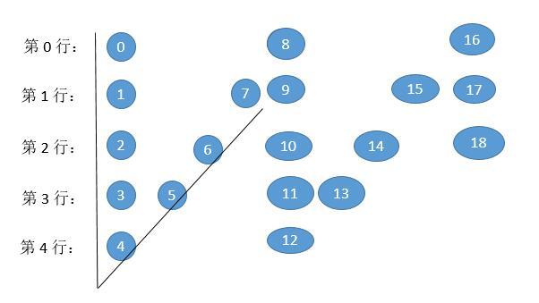

<!--
 * @Date        : 2020-05-02 20:37:47
 * @LastEditors : anlzou
 * @Github      : https://github.com/anlzou
 * @LastEditTime: 2020-05-16 11:36:23
 * @FilePath    : \algorithm\problems\L0006_zigzag-conversion.md
 * @Describe    : 
 -->
## 题目地址

[leetcode](https://leetcode-cn.com/problems/zigzag-conversion/)

## 题目描述

问题：
将一个给定字符串根据给定的行数，以从上往下、从左到右进行 Z 字形排列。

比如输入字符串为 <code>"LEETCODEISHIRING"</code> 行数为 3 时，排列如下：

```
L   C   I   R
E T O E S I I G
E   D   H   N
```

之后，你的输出需要从左往右逐行读取，产生出一个新的字符串，比如："LCIRETOESIIGEDHN"。

请你实现这个将字符串进行指定行数变换的函数：
```
string convert(string s, int numRows);
```

示例：
```
#1
输入: s = "LEETCODEISHIRING", numRows = 3
输出: "LCIRETOESIIGEDHN"
解释：
    L   C   I   R
    E T O E S I I G
    E   D   H   N

#2
输入: s = "LEETCODEISHIRING", numRows = 4
输出: "LDREOEIIECIHNTSG"
解释:
    L     D     R
    E   O E   I I
    E C   I H   N
    T     S     G
```

## 思路
#1 

找出按 V 形排列后字符的*规律*，然后直接保存起来。



1. 我们可以看到，图形其实是有周期的，0，1，2 ... 7 总过 8 个，然后就又开始重复相同的路径。周期的计算就是 cycleLen = 2 × numRows - 2 = 2 × 5 - 2 = 8 个。

2. 我们发现第 0 行和最后一行一个周期内有一个字符，所以第一个字符下标是 0 ，第二个字符下标是 0 + cycleLen = 8，第三个字符下标是 8 + cycleLen = 16 。

3. 其他行都是两个字符。

- 第 1 个字符和第 0 行的规律是一样的。

- 第 2 个字符其实就是下一个周期的第 0 行的下标减去当前行。什么意思呢？

  - 我们求一下第 1 行第 1 个周期内的第 2 个字符，下一个周期的第 0 行的下标是 8 ，减去当前行 1 ，就是 7 了。

  - 我们求一下第 1 行第 2 个而周期内的第 2 个字符，下一个周期的第 0 行的下标是 16 ，减去当前行 1 ，就是 15 了。

  - 我们求一下第 2 行第 1 个周期内的第 2 个字符，下一个周期的第 0 行的下标是 8 ，减去当前行 2 ，就是 6 了。

4. 当然期间一定要保证下标小于 n <code>(n = s.length())</code>，防止越界。

#2
按照写 Z 的过程，遍历每个字符，然后将字符存到对应的行中。用 goingDown 保存当前的遍历方向，如果遍历到两端，就改变方向。

## 关键点
#1
- 周期规律
  - Z 转换为 V
- 越界判断
  - <code>if (i != 0 && i != numRows - 1 && j + cycleLen - i < n) //除去第 0 行和最后一行</code>

#2

我们最终要输出的是以蛇形摆放之后的字符串再按行串联在一起之后的结果，也就是说每一个字母摆放的列并不重要，重要的是摆放的行号。我们可以很容易想到通过数组维护每一行当中摆放的字母，最后将每一行的结果串联即可。所以问题就只剩下了，我们如何知道每一个字母应该摆放在哪一行？

其实这也是有规律的，我们通过观察样例可以发现，我们每一个字母摆放的行号先是从0递增到n-1，再从n-1递减到0。我们就模拟这个过程，一个字符一个字符的放置即可。

比如字符串是“PAYPALISHIRING ”，rowNum=4。我们可以创建四个空串：

<code>“” “” “” “”</code>

然后我们按照蛇形一个字母一个字母地放进这些空串当中：

当放了第一个字母p之后，变成：

<code>“p” “” “” “”</code>

接着放第二个：

<code>“p” “a” “” “”</code>

接着第三个：

<code>“p” “a” “y” “”</code>

当我们把所有字母都放完了之后，可以得到这样的四个串：

<code>“PIN” “ALSIG” “YAHR” “PI”</code>

然后把这四串拼接在一起就行了。
## 代码
[L0006_ZigZagConversion.java](../code/L0006_ZigZagConversion.java)

## 复杂度分析

- 时间复杂度：O(N)
- 空间复杂度：O(N)