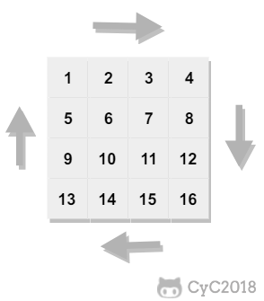

<!--
 * @Date        : 2020-05-02 20:37:47
 * @LastEditors : anlzou
 * @Github      : https://github.com/anlzou
 * @LastEditTime: 2020-10-24 20:09:54
 * @FilePath    : \algorithm\problems\leetcode\problems.md
 * @Describe    : 
 -->
## 题目地址

[leetcode](https://www.nowcoder.com/practice/9b4c81a02cd34f76be2659fa0d54342a)

## 题目描述
顺时针打印矩阵

问题：
```
下图的矩阵顺时针打印结果为：
```
<div align=center></div>

示例：
```
1, 2, 3, 4, 8, 12, 16, 15, 14, 13, 9, 5, 6, 7, 11, 10
```

## 思路
```java
row_begin++;
row_end--;
column_begin++;
column_end--;
```

## 补充
ArrayList和LinkedList在用法上没有区别，但是在功能上还是有区别的。

LinkedList经常用在增删操作较多而查询操作很少的情况下，ArrayList则相反。

## 代码
- [L0009_print_matrix_clockwise.java](../../code/code_leetcode/L0009_print_matrix_clockwise.java)

## 复杂度分析

- 时间复杂度：O(length^2)
- 空间复杂度：O(N)